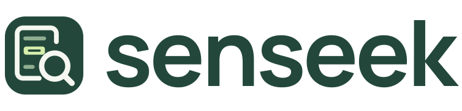
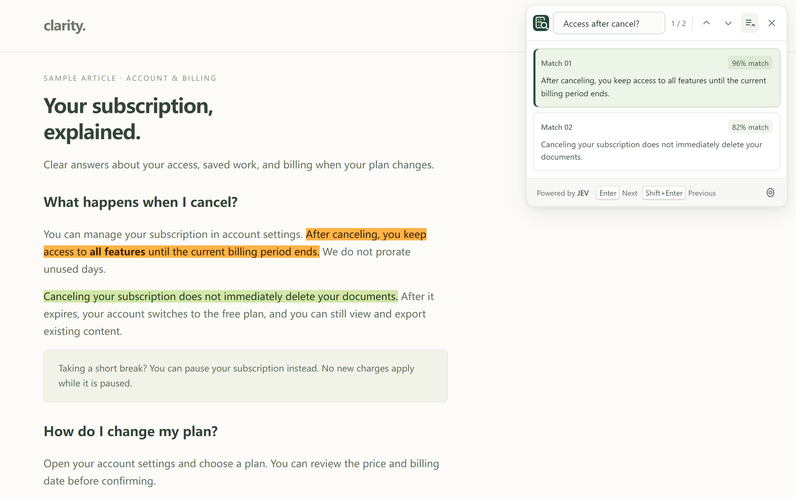

<h1>
  <picture>
    <source media="(prefers-color-scheme: dark)" srcset="./assets/senseek/senseek-logo-inverse.svg">
    
  </picture>
</h1>

[English](./README.md) | **简体中文** | [日本語](./README.ja.md)

> 网页语义搜索 — 用自己的话，找到想找的内容。

Senseek 是一款按含义搜索当前网页的浏览器扩展。它像 Ctrl+F 一样以小巧的搜索框打开，展开后可查看按相关性排序的结果。在设置中填入自己的 JEV API key 即可使用，无需部署后端。

  
   
  在示例页面上的搜索演示，分数仅用于说明。

## 为什么做 Senseek？

网页是为阅读而写的。你可能记得一个概念、条件或答案，却不知道原文用了哪些词。Senseek 让你用自己的话描述想找的内容，直接跳转到相关段落。

通用 LLM 也能实现这类搜索，但 JEV 更适合这项任务。它的专用评估 API 能快速判断段落相关性、选出匹配句子，让搜索保持流畅。

## 工作原理

1. 点击工具栏图标或使用快捷键打开 Senseek。搜索框像浏览器原生查找框一样小巧，尽量不打断阅读。
2. 用自然语言提问，例如“取消订阅后还能继续使用吗？”
3. Senseek 将网页文本拆分成短段落，包括导航链接、按钮文字、页脚和原生折叠区域中的文本。
4. 浏览器将问题和段落直接发送给 JEV，进行语义匹配。
5. 结果按相关性排序，匹配句子会在原网页中高亮。展开搜索框，可以查看每条结果及其置信度。

API key 仅保存在浏览器的扩展本地存储中。搜索请求由浏览器直接发送到 TypeSafe/JEV，不经过 Senseek 服务器。

## Senseek 与 `Ctrl+F` 的区别

| | `Ctrl+F` | Senseek |
| --- | --- | --- |
| 搜索方式 | 精确匹配单词或字符串 | 按含义、概念和不同表述匹配 |
| 查询内容 | 需要知道原文的用词 | 用自己的话描述想找的内容 |
| 搜索结果 | 按在网页中出现的顺序展示 | 按语义相关性排序 |
| 阅读过程 | 需要逐个查看匹配项 | 直接跳转到最相关的段落 |

### `Ctrl+F` 的局限性

- 无法识别同义词或不同的表达方式。
- 依赖网页中出现完全相同的文字。
- 无法理解问题、条件或隐含的答案。
- 长页面中可能出现大量无关匹配，仍需逐条阅读筛选。

Senseek 也有局限：需要有效的 JEV API key 和网络连接。它只搜索当前网页中的文本，选中原生折叠区域内的匹配时会自动展开该区域。图片、扫描版 PDF、无法访问的 iframe 及其他隐藏内容无法检索。

## 开始使用

从[最新 Release](https://github.com/liou666/senseek/releases/latest) 下载 ZIP 并解压，在 Chrome 或 Edge 127 及以上版本中，以未打包扩展程序的方式加载解压后的文件夹。

打开 Settings（设置），填入从 [TypeSafe 控制台](https://console.typesafe.ai/keys) 获取的 API key。点击工具栏图标，或按设置中显示的快捷键，即可打开或关闭 Senseek。

许可证和署名信息见 `extension/LICENSE` 与 `extension/NOTICE`。
